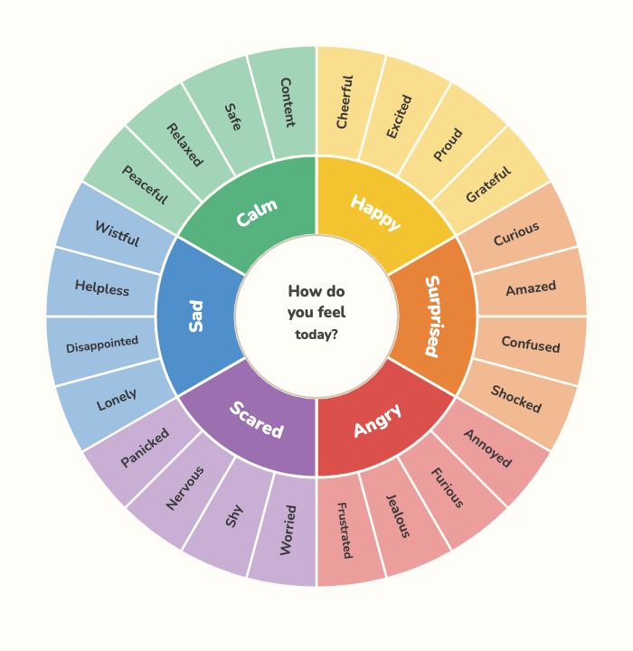
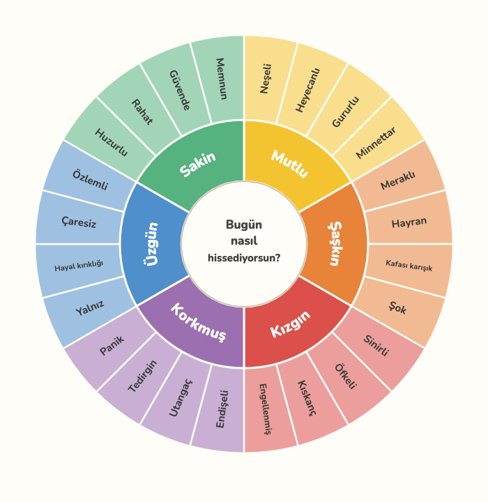

# Feelings Wheel 🎡

A free, printable **feelings wheel** and matching **monthly emotion tracker**
to help kids name what they feel — in their own language, **at their own age**.

Six core emotions in the middle, each surrounded by more nuanced feelings, so a
child can move from "happy" to *grateful*, or "angry" to *frustrated*. Print it,
put it on the fridge, and use it together.

It comes in **three age levels** — choose by how many rings:

| Rings | Ages | What's on it |
|:-----:|:----:|--------------|
| **1** | 4–9  | The 6 core feelings. Big and clear for early readers. (wheel only) |
| **2** | 9–12 | Core + 24 nuanced feelings, plus the monthly tracker. |
| **3** | 12+  | The full map — 48 fine-grained feelings — plus the tracker. |

<p align="center">
  
  
</p>

## ⬇️ Download &amp; print

**Easiest:** visit the website → **https://cakuki.github.io/feelings-wheel/**,
pick your language, then pick your child's age.

Or grab a file straight from the [**latest release**](../../releases/latest):

- `feelings-wheel-<lang>-1ring.pdf` — ages 4–9 (wheel only)
- `feelings-wheel-<lang>-2ring.pdf` — ages 9–12 (wheel + tracker)
- `feelings-wheel-<lang>-3ring.pdf` — ages 12+ (wheel + tracker)
- a matching `.zip` for each, with the SVG, preview image, and HTML
- `feelings-wheel-<lang>.pdf` (no suffix) is the 2-ring sheet, kept for older links

Open the PDF and print at 100% / "Actual size" on A4. That's it — no account,
no paywall, free forever.

**Available languages:** 🇬🇧 English · 🇩🇪 Deutsch · 🇪🇸 Español · 🇫🇷 Français · 🇹🇷 Türkçe

Want yours? [Adding a language](CONTRIBUTING.md) is a small, welcome PR.

## How to use it with your child

1. Find the core emotion in the middle that feels closest right now.
2. Move outward to a more specific feeling in the same color.
3. Say it out loud and talk about *when* you felt it. There's no wrong feeling.
4. On the second page, color one circle a day to see the week's mood at a glance.

## Build from source

Pure Python standard library — no dependencies. You only need **Python 3** and
**Google Chrome** (used to render the PDF and preview).

```sh
python3 build.py                 # all languages x 3 tiers -> out/<lang>/<tier>ring/
python3 build.py en de            # only these languages
python3 build.py --tier 2         # only the 2-ring tier
python3 build.py --package        # also write release bundles to dist/
python3 build.py --no-pdf         # SVG + HTML only (skip Chrome)
python3 build_site.py            # regenerate the landing page (docs/)
```

Each language/tier produces `out/<lang>/<tier>ring/`: `wheel.svg`, `index.html`
(print this from a browser if you don't want the PDF step), `wheel.pdf`, and
`wheel-preview.png`.

For pixel-identical output everywhere, the project pins the open-source
[**Nunito**](https://fonts.google.com/specimen/Nunito) font. Install it once so
your local build matches the released PDFs (CI does the same automatically):

```sh
# macOS
curl -fsSL -o ~/Library/Fonts/Nunito.ttf \
  "https://github.com/google/fonts/raw/main/ofl/nunito/Nunito%5Bwght%5D.ttf"
# Linux
mkdir -p ~/.fonts && curl -fsSL -o ~/.fonts/Nunito.ttf \
  "https://github.com/google/fonts/raw/main/ofl/nunito/Nunito%5Bwght%5D.ttf" && fc-cache -f
```

## How it works

| File | Role |
|------|------|
| `languages/<code>.toml` | one translation per file — emotions, feelings, ring-3 `leaves`, and the website's `[site]` text (easy to add/review) |
| `languages.py` | loads the TOML files + holds the shared color palette |
| `gen_wheel.py` | draws the wheel SVG for a tier (arc geometry, curved labels, 1–3 rings) |
| `build_html.py` | wraps the SVG in a print-ready A4 HTML (+ tracker from tier 2 up) |
| `build.py` | orchestrates SVG → HTML → PDF/preview across tiers, packages bundles |
| `build_site.py` | generates the translatable landing page (`docs/`) |
| `fit_check.js` | browser-measured check that every label fits its ring |

The six core labels are curved along the ring with SVG `<textPath>` (flipping on
the bottom half so they stay upright). Because different languages have different
word lengths, each language sets a `core_font` size so its longest word fills the
wedge without crowding the dividers. The outer rings (nuanced feelings and the
fine "leaves") are radial labels sized to their ring depth.

See [ATTRIBUTION.md](ATTRIBUTION.md) for the design's provenance — it's an
original work; the wheel *concept* is credited to Plutchik and Willcox.

### Keeping labels inside the lines (the feedback loop)

Rather than eyeballing font sizes, `fit_check.js` measures the **real rendered
geometry** of every label in the browser and reports anything that overflows.
Open `out/<lang>/index.html`, paste `fit_check.js` in the DevTools console, and
run `fitCheck()` — `{ ok: true, fails: [] }` means everything fits. Run it after
any change to wording or geometry.

## Tests

```sh
python3 -m unittest discover -s tests -t .
```

Pure standard library, no test framework to install. Two checks:

- **SVG geometry** — the viewBox is a centered square, so the wheel sits in the
  middle of its own canvas for every tier (fast, no browser).
- **Print layout** — renders each tier's print HTML in headless Chrome,
  screenshots it at A4 proportions, and measures where the colored wheel lands,
  asserting it is horizontally centered and fits the page with margins on both
  sides. This catches rendering bugs a font-size check can't (a wheel left-
  aligned, or wider than the page). Skipped automatically if Chrome isn't found.

CI runs the suite on every pull request and before each release.

## Releases

Pushing a `v*` tag triggers [CI](.github/workflows/release.yml) to rebuild every
language and publish a GitHub Release with the per-language downloadables
attached. Pull requests build all languages as a check.

## Credits

- Concept based on the classic emotion-wheel work of **Robert Plutchik** and
  **Gloria Willcox**.
- Typeface: [**Nunito**](https://fonts.google.com/specimen/Nunito) by Vernon
  Adams et al., under the SIL Open Font License.

## License

[MIT](LICENSE) — use it, remix it, print a thousand of them. If it helps a kid,
it's done its job. 💛
